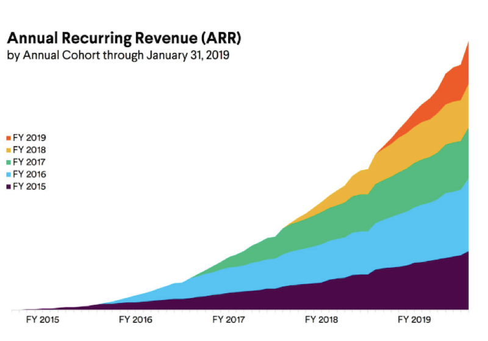
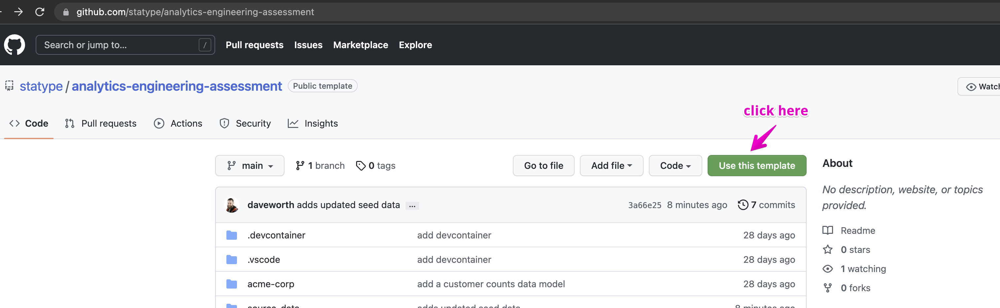
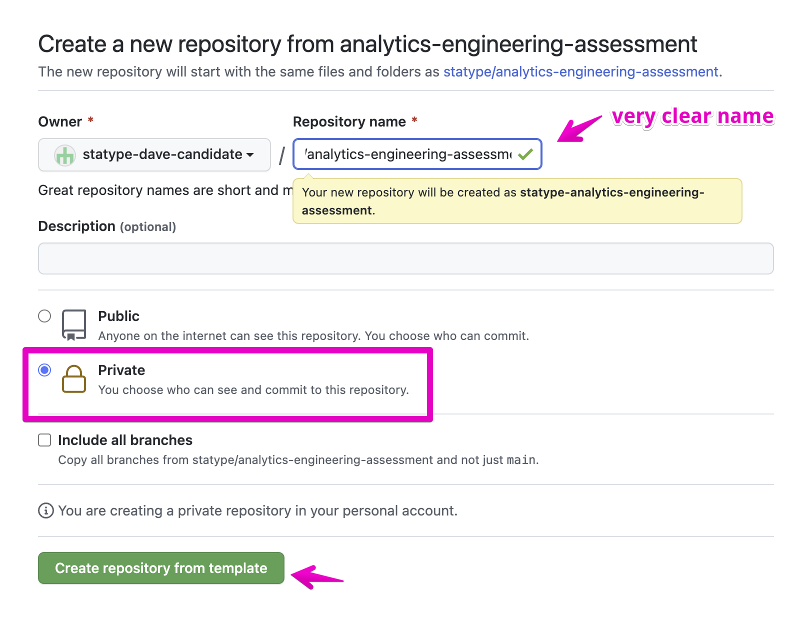
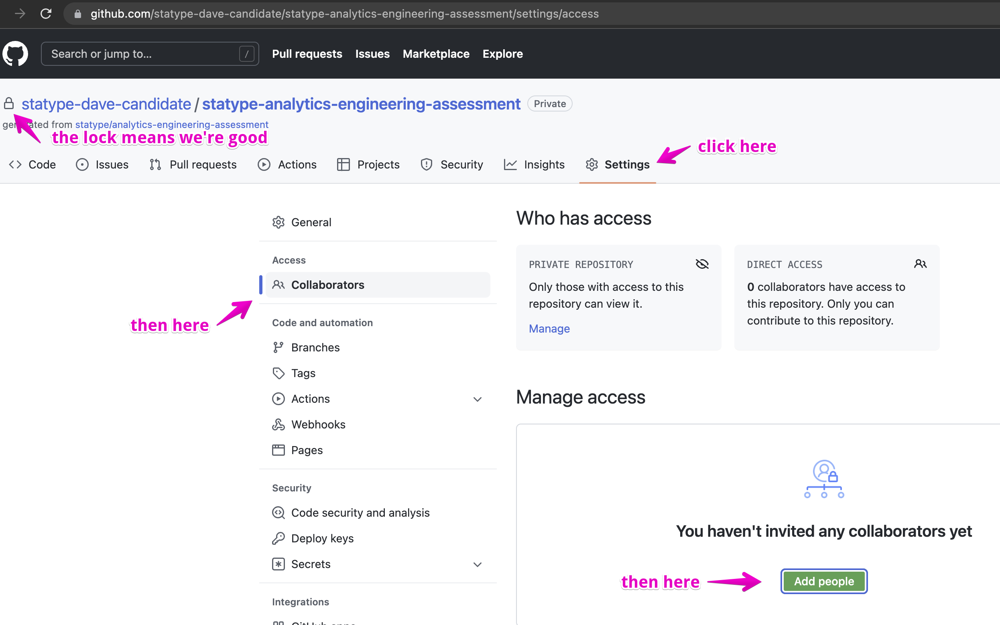

# Product Engineering Technical Assessment

## Overview

This repository contains a small web application application which renders a
line-graph with two generated data-sets which you will be expected to augment in
a few possible ways.  The assignment itself provides some options as to what
you'd like to accomplish and what you are most confident in. The goal of this
assessment is not to produce a perfect or polished result.  It is intended to
show what you can do and figure out in a limited time to create a foundation
that can be iterated on later with others.

This process can be conducted either asynchronously in your own time with a
followup session with one of our Product Engineers later or as a pairing session
over a video call.  In the async case Part 2 will be a written assignment and in
the pairing case it will be a discussion with the interviewer.  If you opt to
pair with a Product Engineer take the time before the interview to get setup as
described in the "Getting Started" section _before_ the interview.  If you run
into any hurdles let us know and we are happy to help.

If you opt for the async option, please take 2-3h to complete the assignments.
3 hours is an absolute maximum. We would rather an unpolished working solution
after 2 hours than an incredibly polished and "perfect" solution after 10.)

<!--
autogenerated ToC from the Markdown All in One VSCode Extension:
https://marketplace.visualstudio.com/items?itemName=yzhang.markdown-all-in-one
-->
- [Product Engineering Technical Assessment](#product-engineering-technical-assessment)
  - [Overview](#overview)
  - [The Assignments](#the-assignments)
    - [Part 1 - Add new stuff](#part-1---add-new-stuff)
      - [Option 1 - Add a new page](#option-1---add-a-new-page)
        - ["Stack ALL the Things"](#stack-all-the-things)
      - [Option 2 - Extend a Dependency](#option-2---extend-a-dependency)
    - [Part 2 - More than just the code](#part-2---more-than-just-the-code)
      - [Option 1 - Testing](#option-1---testing)
      - [Option 2 - Developer Experience and Tooling](#option-2---developer-experience-and-tooling)
    - [Part 3 - Extra Credit (_only_ if you have time to spare)](#part-3---extra-credit-only-if-you-have-time-to-spare)
  - [Getting Started](#getting-started)
    - [Get the assignment](#get-the-assignment)
    - [Setting up your computer](#setting-up-your-computer)
    - [Up and Running](#up-and-running)

## The Assignments

### Part 1 - Add new stuff

Choose one of the following assignments:

#### Option 1 - Add a new page

##### "Stack ALL the Things"

Add a new route to the application which houses a "revenue data".  The new route
should render a view that includes a stacked area graph representing the
(hopefully) increasing over time revenue per "Cohort".  A "Cohort" is a group of
customers who joined in the same period - depending on the age/maturity of the
company cohorts could be months or years.  Be sure to generate "realistic" data
that is displayed and some randomness for realism is welcome.

For inspiration below is a _very_ early mockup of such a graph:

#### Option 2 - Extend a Dependency

The [`styd/apexcharts.rb`](https://github.com/styd/apexcharts.rb) Ruby wrapper
to [ApexCharts](https://apexcharts.com/) does not provide all of the graph types
that the Javascript library provides - for example the Treemap graph type is not
supported.  Add support for Treemaps to this application such that there is a
`treemap(...)` view helper available to this application in exactly the same way
the `line_chart(...)` helper is provided by the Rubygem as seen in
`views/index.erb`.  The functionality you add should still call the ApexCharts
Treemap Javascript implementation as if the Ruby library had provided it.

### Part 2 - More than just the code

Choose one of the following and complete the assignment(s) within.  Each section
will ask you to "Describe, defend, and critique" something.  The reason for this
rather than a free form "tell me about X" question is you have a framework to
deliver an answer rather than guessing what the interview(er) is asking of you.
There is no "right" answer to these questions - we are looking for your ability
to discuss how you think about various aspects of our technical work.

#### Option 1 - Testing

Part 1: Describe, defend, and critique your testing philosophy in a few brief
sentences per section.

_Example:_

> My testing philosophy at a high-level is ... (156 words)
>
> This philosophy allows [several good things] by [some behaviors] (193 words)
>
> This philosophy isn't always perfect [some ways it may not work out] (187 words)

Part 2: We have intentionally introduced two different and competing testing
tools into this project - one could imagine the team is in the midst of a
piecemeal migration from one to the other.

Assuming you prefer one of the two frameworks over the other (minitest or
RSpec), port the existing (and any new specs from the above work) from your
preferred tool to the tool you prefer less.  If you have no preference flip a
coin and include photographic evidence of the coin-flip.

Describe any compromises you had to make in the process.  What improvements may
this change have introduced regardless of your initial preferences.

#### Option 2 - Developer Experience and Tooling

Part 1: Describe, defend, and critique your favorite developer tool used during
the process of building a web application in a few brief sentences per section.

Developer tools, in this case, are defined as tools that contribute to the
process of starting a task and delivering it to production.  Thus they may
include editors or their plugins, tools that contribute to rapid experimentation
and feedback loops (REPLs), testing tools (including CI/CD), platforms you rely
on for quality (GitHub/GitLab), or deployment platforms (Heroku, Netlify, etc.)

_Example:_

> My favorite tool to use while building [Web Apps, SPAs, APIs] is [tool] because ... (176 words)
>
> In particular [tool] enables me to [things it enables] ... (192 words)
>
> While [tool] is great one drawback is that it [isn't super great in some context] ... (181 words)

Part 2a: Add your favorite tool to the devcontainer packaged here and show what
it enables.

_or_

Part 2b: [`rubocop`](https://github.com/rubocop/rubocop) is a best-practices
linter for Ruby (which supports Rails as well).  Its mission is to standardize
the style of Ruby written so that code-review can be focussed on the important
contents of changes and not nit-picky around style things.  We like standards.
[`standardrb`](https://github.com/testdouble/standard) is effectively a "better"
set of rules for Rubocop.  Both are installed in your container and can be run
via `bundle exec rubocop` and `bundle exec standardrb` respectively.  Without
running them in autofix-mode run them, compare the outputs, and make a
recommendation on either running the suggested fixes or not doing so.

### Part 3 - Extra Credit (_only_ if you have time to spare)

As the tests of our generators are defined today they are not terribly precise
in that because of the calls to `rand(...)` in them we are only able to make
bounds on the values the generators produce.

Describe how you would, and/or simply change the existing tests, to more
accurately capture randomness with greater confidence.

## Getting Started

### Get the assignment

1. This repository is a template repository. Please use the _`Use this template`_
to create a new _Private_ repository in your personal GitHub account:

2. On the next screen please select these options:

3. Add your Statype contact as an external contributor - they should have
  provided their Github Username but if they forgot please just ask:

_Note_: The above screenshots are for our Analytics Engineering Technical
Assessment project and the steps should be nearly identical for this project -
just replace the words "Analytics Engineering" with "Product Engineering"
everywhere.

### Setting up your computer

_Prerequisites_:

- Ensure you have [VSCode](https://code.visualstudio.com/download) installed locally.
- Ensure you have [Docker](https://docs.docker.com/get-docker/) installed locally.

When you open this repository in VSCode you should be prompted to re-open the
project in a container which has Ruby pre-configured and libraries installed via
`bundle install`

### Up and Running

Once the devcontainer is running you can start the application via
`bundle exec ruby grapher.rb` which will connect the application to
your [localhost:4567](localhost:4567)

You can run all of the tests via `rake` or  `rake all` or the minitest tests via
`rake test` and the RSpecs via `rake spec`.
